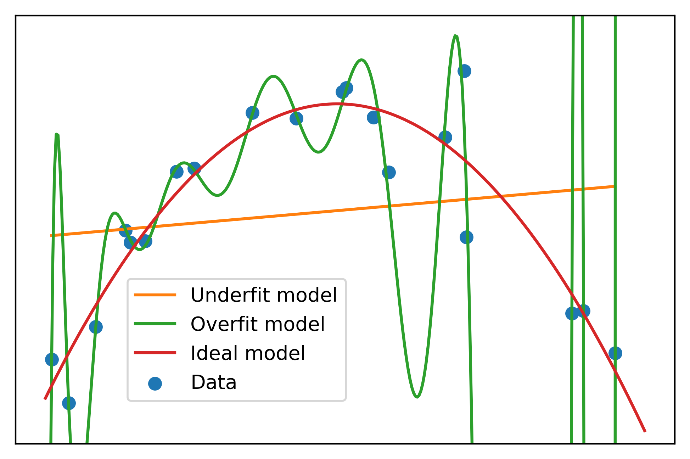

<!--
**gitcoffee/gitcoffee** is a ✨ _special_ ✨ repository because its `README.md` (this file) appears on your GitHub profile.

Here are some ideas to get you started:

- 🔭 I’m currently working on ...
- 🌱 I’m currently learning ...
- 👯 I’m looking to collaborate on ...
- 🤔 I’m looking for help with ...
- 💬 Ask me about ...
- 📫 How to reach me: ...
- 😄 Pronouns: ...
- ⚡ Fun fact: ...
-->
### Hello, I'm Jose Luis! 👋

I'm a developer passionate about **artificial intelligence** and **web design**.

#### 🛠️ Technologies and Tools
- **Languages:** Python, JavaScript, HTML, CSS, Php ....
- **Frameworks:** Django, Vue, Tailwind CSS ...
- **Tools:** Git, Docker, Jupyter Notebook ...

#### 📈 Featured Projects
- **[Coupons](https://github.com/gitcoffee/coupons)**: Learn Machine Learning and Artifical Inteligence / Certificate ML_AI / Berkeley

#### 📫 Contact
- [LinkedIn](https://www.linkedin.com/in/jose-unix-b6693315/)
- [Twitter](https://x.com/joseluisUnix)
- [Email](mailto:1800joseluis@gmail.com)

#### 🎯 Current Goals
- Learn more about **Machine Learning**.
- Improve skills in **UX/UI design**.

---
